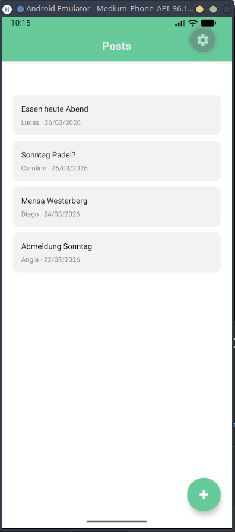
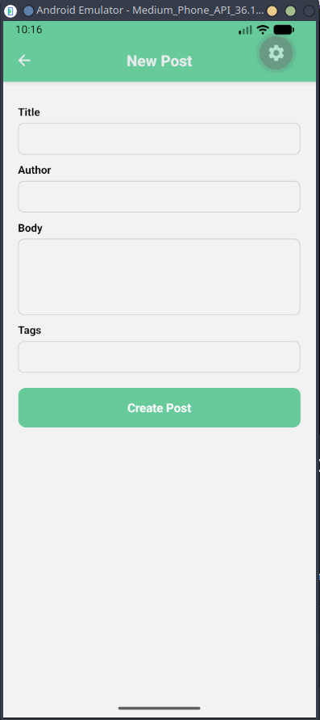
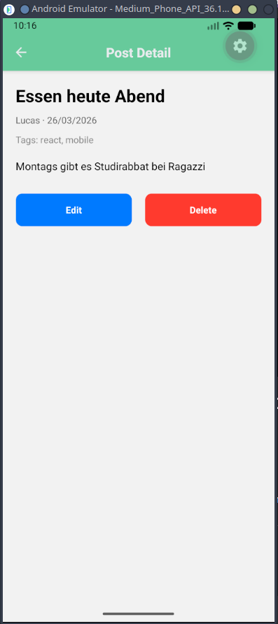
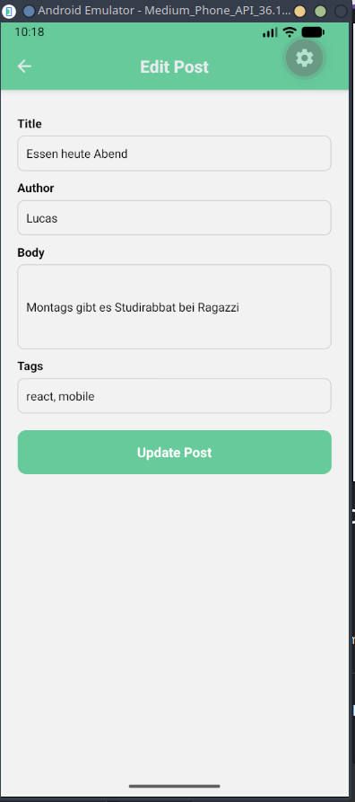
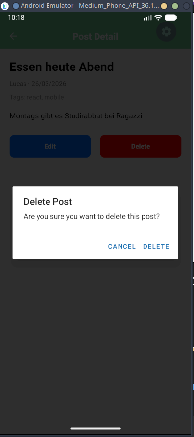

# Social App

Example of a small social network app using React Native.


## Table of Contents
1. [About the Project](#about-the-project)
2. [Build and Install](#build-and-install)
3. [Getting Started](#getting-started)
5. [Project Status](#project-status)


# About the project

# Build and Install

# Getting started
## Web App
Run the following command in the root directory:
This will start the REST API present in the api directory
```
npx turbo run dev
```

## Mobile App
Run inside the apps/app/ to start the frontend (web or emulator):

For emulator configuration (path where the sdk is located):
```
export ANDROID_HOME=$HOME/Android/Sdk
```
Additionally you can run these commands to optimize if you are using linux:
```
export ELECTRON_DISABLE_SANDBOX=1
export CHROME_DEVEL_SANDBOX=0
```
Finally run the project with:
```
npx expo start
```
In case node -v returns version 14 change to version 20 with:
```
nvm use 20
```
To open the android emulator onces the project is running press a
# Project Status
- [x] Lab 1: Prepare the project and install all requirements
- [x] Lab 2: Prepare the Frontend with homescreen, new post creation, edits, etc.


## Pictures

<p align="center">
    <br>
    <em>Home Screen</em>   
</p>

<p align="center">
    <br>
    <em>Create a new post</em>
</p>


<p align="center">
    <br>
    <em>Details of the post</em>
</p>


<p align="center">
    <br>
    <em>Edit any post</em>
</p>


<p align="center">
    <br>
    <em>Warning popup before deleting a post</em>
</p>

